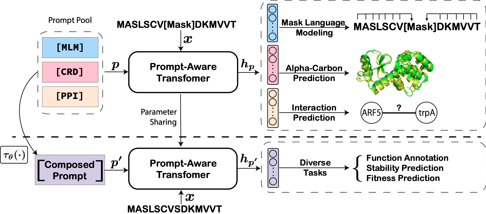

# PromptProtein
The official implementation of the ICLR'2023 paper Multi-level Protein Structure Pre-training with Prompt Learning. PromptProtein is an effective method that leverages prompt-guided pre-training and fine-tuning framework to learn multi-level protein sturcture.

## Overview
In this work we present PromptProtein, a structural-enhanced protein language model that jointly optimize the MLM, CRD, and PPI objectives, which bring excellent improvements to a wide range of protein tasks.



## Dedicated Sentinel Tokens as Prompts
Protein structure can be divided into four levels: The primal is the protein sequence consisting of amino acids; the second refers to the local folded structures (e.g., $\alpha$ helix and $\beta$ pleated sheet); the tertiary describes the natural folded three-dimensional structure; and the quaternary is a protein multimer comprising multiple polypeptides. A protein can focus on different structure levels to implement its specific functions, including reserving a piece of the sequence, manifesting the whole 3D structure as conformational elements, or even cooperating with other proteins. Therefore, when predicting protein functions, it is vital to flexibly utilize multi-level structural information. 

In the field of natural language processing, researchers design prompts to effectively use the knowledge stored in LLMs. Inspired by this idea, we can associate protein structure information to prompts, and flexibly use multi-level structural information through the prompt engineering. Here, we propose three dedicated sentinel tokens `<MLM>`, `<CRD>`, `<PPI>` to associate primary, tertiary, and quaternary structural information.

Through experiments, we find that the learnable Prompt can improve the performance, but the initialization of Prompt is very important. When we initialize Prompt with the embedding of `<CRD>`, the $F_{\mathtt{max}}$ of the model on GO-BP is less than 0.3. That is to say, when the decoder and Prompt are trained together, the prompt can be easily optimized to local optimum rather than a global optimum. This may be caused by (1) the sparse knowledge of the model, which needs to add more protein-related pre-training tasks; (2) lack of more effective prompt tuning methods. We leave these for future work.

In this paper, we made a preliminary exploration on how to apply prompt technology to protein language model. We have designed many prompts related to protein characteristics on protein language model in [PromptProtein](https://hicai-zju.github.io/ProteinPromptEngineering//) and left them for future work.


Model is available at: [OneDrive](https://zjueducn-my.sharepoint.com/:u:/g/personal/yuanzew_zju_edu_cn/EWgFQ7W3aNpOn5XP_ZzQj3QBcVwxEdqgdgM4qLCvsjNqKA?e=LtUNhb)
## How to Cite
```
@inproceedings{
    wang2023multilevel,
    title={{M}ulti-level {P}rotein {S}tructure {P}re-training via {P}rompt {L}earning},
    author={Zeyuan Wang and Qiang Zhang and Shuang-Wei HU and Haoran Yu and Xurui Jin and Zhichen Gong and Huajun Chen},
    booktitle={The Eleventh International Conference on Learning Representations },
    year={2023},
    url={https://openreview.net/forum?id=XGagtiJ8XC}
}
```
